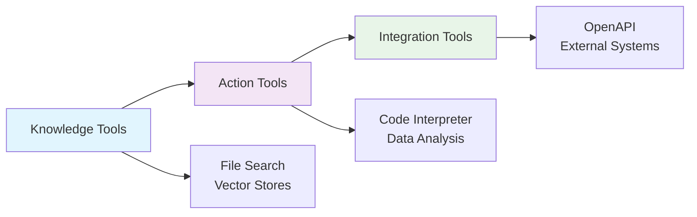

# 🔧 Exercise 3: Agent with Tools

<div align="center">


### **Master AI Agent Tool Integration for Industrial Applications**

*Enhance your agents with powerful tools for knowledge retrieval, code execution, and external API integration*

</div>

---

## 🎯 **Learning Objectives**

By completing this exercise, you will:

- **🔍 Master File Search**: Implement knowledge retrieval with vector stores
- **💻 Harness Code Interpreter**: Execute Python code for data analysis  
- **🌐 Integrate APIs**: Connect agents to external systems via OpenAPI
- **🏭 Apply Industrial Context**: Build tools for manufacturing environments
- **🔄 Understand Tool Progression**: From knowledge to action tools

---

## 🛠️ **Tool Types Overview**

### **📚 Knowledge Tools - File Search**
> *Enable agents to search and retrieve information from documents*

- **Vector Store Integration**: Semantic search across documents
- **Document Processing**: Upload and index various file formats
- **Contextual Retrieval**: Find relevant information for queries
- **Use Cases**: Documentation search, compliance lookup, technical manuals

### **⚡ Action Tools - Code Interpreter**
> *Allow agents to write and execute Python code in secure environments*

- **Data Analysis**: Process CSV, JSON, and Excel files
- **Visualization**: Generate charts, graphs, and reports
- **Mathematical Computing**: Perform complex calculations
- **Use Cases**: KPI analysis, trend detection, statistical reports

### **🌐 Integration Tools - OpenAPI**
> *Connect agents to external systems and enterprise applications*

- **REST API Integration**: CRUD operations on external systems
- **Schema Validation**: Automatic request/response validation
- **Authentication Support**: API keys, OAuth, and more
- **Use Cases**: ERP integration, inventory management, system automation

---

## 📁 **Project Structure**

```
EX3-AgentWithTools/
├── README.md                                 # This file
├── samples/                                  # Sample implementations
│   ├── ex3-s1-AgentWithFileSearch-aad.py   # File Search + AAD auth
│   ├── ex3-s1-AgentWithFileSearch-sp.py    # File Search + Service Principal
│   ├── ex3-s2-AgentWithCodeInterpreter-aad.py  # Code Interpreter + AAD
│   ├── ex3-s2-AgentWithCodeInterpreter-sp.py   # Code Interpreter + SP
│   ├── ex3-s3-AgentWithOpenAPI-aad.py      # OpenAPI integration + AAD
│   ├── ex3-s3-AgentWithOpenAPI-sp.py       # OpenAPI integration + SP
│   └── InventoryAPI.json                    # Sample OpenAPI specification
└── challenge/                               # Hands-on exercises
    └── [Challenge files - Coming Soon]
```

---

## 🚀 **Quick Start Guide**

### **Prerequisites**
- ✅ Completed [EX1-FirstAIChat](../EX1-FirstAIChat) and [EX2-FirstAgent](../EX2-FirstAgent)
- ✅ Azure AI Foundry project configured
- ✅ Python environment with required packages
- ✅ Authentication method configured (AAD or Service Principal)

### **Installation**
```bash
# Install required packages
pip install azure-ai-projects azure-identity python-dotenv

# Configure environment variables
cp .env.example .env
# Edit .env with your Azure AI Foundry details
```

### **Environment Variables**
```bash
# Required for all samples
AI_FOUNDRY_ENDPOINT=your_azure_ai_foundry_endpoint
AI_FOUNDRY_DEPLOYMENT_NAME=your_model_deployment_name

# For Service Principal authentication (SP versions)
AZURE_TENANT_ID=your_tenant_id
AZURE_CLIENT_ID=your_client_id
AZURE_CLIENT_SECRET=your_client_secret
```

---

## 📖 **Sample Explanations**

### **🔍 Sample 1: File Search Agent**
> *Industrial Documentation Assistant*

**Files**: `ex3-s1-AgentWithFileSearch-*.py`

**Key Features**:
- Vector store creation and management
- Document upload and indexing (PDF, DOCX, TXT)
- Semantic search across technical documentation
- Industrial compliance and safety manual queries

**Industrial Use Cases**:
- Safety procedure lookup
- Technical specification search
- Compliance document retrieval
- Equipment manual queries

**Demo Flow**:
1. Creates vector store for document storage
2. Uploads sample industrial documentation
3. Demonstrates semantic search capabilities
4. Interactive Q&A session with documents

### **💻 Sample 2: Code Interpreter Agent**
> *Industrial Data Analyst*

**Files**: `ex3-s2-AgentWithCodeInterpreter-*.py`

**Key Features**:
- Python code execution in secure sandbox
- Data analysis with pandas, matplotlib, numpy
- Manufacturing KPI calculations
- Visualization generation and file downloads

**Industrial Use Cases**:
- OEE (Overall Equipment Effectiveness) analysis
- Quality control statistical analysis
- Equipment performance trending
- Production efficiency reporting

**Demo Flow**:
1. Creates sample manufacturing data
2. Performs OEE calculations and analysis
3. Generates quality control charts
4. Interactive data analysis session

### **🌐 Sample 3: OpenAPI Integration Agent**
> *Industrial Inventory Manager*

**Files**: `ex3-s3-AgentWithOpenAPI-*.py`, `InventoryAPI.json`

**Key Features**:
- Comprehensive inventory management API
- CRUD operations on inventory items
- Stock level monitoring and alerts
- Utilization reporting and analytics

**Industrial Use Cases**:
- Raw material tracking
- Equipment inventory management
- Consumables monitoring
- Production planning support

**Demo Flow**:
1. Loads OpenAPI specification for inventory API
2. Demonstrates inventory search and filtering
3. Shows stock management operations
4. Interactive inventory management session

---

## 🔐 **Authentication Options**

### **🎯 Azure Default Credential (AAD)**
> *Recommended for development environments*

**Files**: `*-aad.py`

**Benefits**:
- Seamless integration with Azure CLI and VS Code
- No credential management required locally
- Perfect for development and testing

**Setup**:
```bash
# Login via Azure CLI
az login

# Or use VS Code Azure extension
# Extension will handle authentication automatically
```

### **🔑 Service Principal (SP)**  
> *Recommended for production environments*

**Files**: `*-sp.py`

**Benefits**:
- Non-interactive authentication
- Fine-grained access control
- Ideal for CI/CD pipelines and production

**Setup**:
1. Create service principal in Azure AD
2. Assign appropriate roles and permissions
3. Configure environment variables with credentials

---

## 🎨 **Tool Integration Patterns**

### **📋 Progressive Tool Usage**



### **🔄 Tool Combination Strategies**

**Sequential Processing**:
1. **File Search** → Retrieve relevant documentation
2. **Code Interpreter** → Analyze extracted data  
3. **OpenAPI** → Update external systems

**Parallel Processing**:
- **File Search** + **OpenAPI** → Context-aware system updates
- **Code Interpreter** + **OpenAPI** → Analysis-driven automation

---

## 🏭 **Industrial Applications**

### **🔧 Manufacturing Operations**
- **Quality Management**: Document search + statistical analysis
- **Equipment Maintenance**: Manual lookup + performance analysis
- **Production Planning**: Data analysis + ERP integration

### **📊 Supply Chain Management**
- **Inventory Optimization**: Real-time data + predictive analysis
- **Supplier Management**: Document processing + API integration
- **Demand Forecasting**: Historical analysis + system updates

### **🛡️ Compliance & Safety**
- **Regulatory Compliance**: Document search + reporting
- **Safety Management**: Incident analysis + system updates
- **Audit Preparation**: Data extraction + report generation

---

## 🎯 **Best Practices**

### **🔍 File Search Optimization**
- Use descriptive filenames and metadata
- Organize documents by categories and tags
- Implement proper chunking strategies
- Regular vector store maintenance

### **💻 Code Interpreter Security**
- Validate data sources and formats
- Implement error handling and logging
- Use appropriate visualization libraries
- Monitor execution time and resources

### **🌐 OpenAPI Integration**
- Comprehensive API documentation
- Proper authentication mechanisms
- Error handling and retry logic
- Rate limiting and throttling

---

## 🔧 **Troubleshooting**

### **Common Issues**

**🔍 File Search Problems**:
- ❌ Vector store creation fails → Check file formats and sizes
- ❌ Search returns no results → Verify document indexing
- ❌ Poor search quality → Improve document structure

**💻 Code Interpreter Issues**:
- ❌ Code execution timeout → Optimize algorithms and data size
- ❌ Import errors → Use supported libraries only
- ❌ Memory limitations → Process data in chunks

**🌐 OpenAPI Failures**:
- ❌ Authentication errors → Verify API credentials
- ❌ Schema validation fails → Check request format
- ❌ Rate limiting → Implement proper throttling

### **🔧 Debug Commands**
```bash
# Test authentication
python -c "from azure.identity import DefaultAzureCredential; DefaultAzureCredential().get_token('https://management.azure.com/.default')"

# Validate OpenAPI spec
python -c "import json; json.load(open('InventoryAPI.json'))"

# Check environment variables
python -c "import os; print('Endpoint:', os.getenv('AI_FOUNDRY_ENDPOINT'))"
```

---

## 📚 **Additional Resources**

### **📖 Documentation**
- [Azure AI Foundry Tools Documentation](https://docs.microsoft.com/azure/ai-foundry/)
- [OpenAPI Specification Guide](https://swagger.io/specification/)
- [Vector Store Best Practices](https://docs.microsoft.com/azure/search/)

### **🛠️ Tools & Libraries**
- [Azure AI Projects SDK](https://pypi.org/project/azure-ai-projects/)
- [Azure Identity](https://pypi.org/project/azure-identity/)
- [OpenAPI Tools](https://openapi-generator.tech/)

### **🎓 Learning Path**
1. Complete EX1: Basic AI Chat
2. Complete EX2: Agent Service
3. **Complete EX3: Agent Tools** ← *You are here*
4. Continue to EX4: Agent with AI Search
5. Advance to EX5: Agent Orchestration

---

## 🎉 **Next Steps**

Ready to advance your agent capabilities? Here's what comes next:

- **🔍 [EX4: Agent with AI Search](../EX4-AgentWithAISearch)** - Advanced search and retrieval
- **🎭 [EX5: Agent Orchestration Service](../EX5-AgentOrchestrationService)** - Multi-agent coordination
- **🧠 [EX6: Semantic Kernel Integration](../EX6-AgentOrchestrationSemanticKernel)** - Enterprise orchestration

---

<div align="center">

### **🚀 Ready to Build Industrial AI Agents with Advanced Tools?**

**Choose your learning path and start building!**

[](samples/ex3-s1-AgentWithFileSearch-aad.py)
[](samples/ex3-s2-AgentWithCodeInterpreter-aad.py)
[](samples/ex3-s3-AgentWithOpenAPI-aad.py)

</div>

---

<div align="center">
<sub>Built with ❤️ for the IBM AI Masterclass | Empowering Industrial AI Innovation</sub>
</div> 